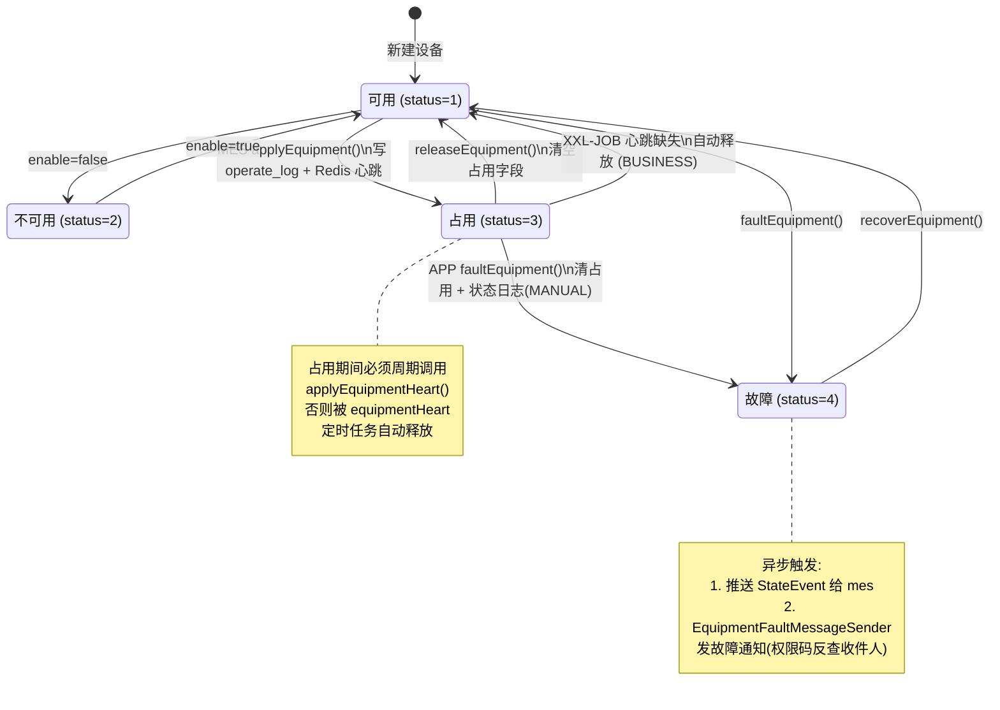

# Platform 设备模块

## 概述 / 职责

platform 的**设备台账、分类、设备类型(tag)、状态机、操作/状态日志、采集点、设备工位**管理，并通过 `EquipmentConfigFeign` 对外暴露——**MES 在称量/配料/生产/存储等环节大量调用此 Feign** 占用/释放/反查设备。设备故障时通过消息中心向持 `100030001000015` 权限码的用户推送告警。

- 所属服务：[[platform-overview]]（60100）
- 业务表前缀：`bp_equipment_*` + `bp_acquisition_point` + 工位 `bp_equipment_station*`
- 主包：`service/equipment/`；工位相关 Service 落在 `service/factory/`（与工厂模型树共享包）
- 跨服务依赖：mes → platform（单向），wms/lims 当前未直接引用

## 结构图

### 整体分层结构

```mermaid
flowchart TB
    subgraph MES["消费方（跨服务，Feign 单向）"]
        MES_W[mes: 称量/配料/存储/执行]
    end

    subgraph FACADE["bmos-platform-facade（对外契约）"]
        F1["EquipmentConfigFeign<br/>contextId=platform-equipment"]
        F2["EquipmentInfoFeignVO / EquipmentApplyHeartDTO / EquipmentQueryDTO"]
    end

    subgraph CTRL["equipment/controller（REST 入口）"]
        C1["EquipmentInfoController /equipment<br/>台账 CRUD + 启停 + 采集点绑定"]
        C2["EquipmentCategoryController /equipment/category<br/>分类树"]
        C3["EquipmentTagController /equipment/tag<br/>设备类型(tag) 树"]
        C4["EquipmentLogController /equipment/log<br/>操作/状态日志"]
        C5["EquipmentAppController /equipment/app<br/>APP 端: 占用/释放/故障/恢复"]
        C6["EquipmentController /equipment<br/>点位数据 + MQTT 授权"]
        C7["EquipmentFeignController /equipment/feign<br/>implements EquipmentConfigFeign"]
        C8["AcquisitionPointController /acquisitionPoint<br/>采集点 CRUD + 导入导出"]
    end

    subgraph FACTORY_CTRL["factory/controller（工位设备）"]
        C9["EquipmentStationController /equipment/station<br/>工位 + 绑定设备/用户"]
    end

    subgraph SVC["equipment/service（业务实现）"]
        S1["EquipmentInfoService<br/>台账 CRUD / 启停 / 采集点绑定"]
        S2["EquipmentTagService ★<br/>applyEquipment 占用<br/>releaseEquipment 释放<br/>faultEquipment 故障<br/>recoverEquipment 恢复"]
        S3["EquipmentCategoryService<br/>分类树"]
        S4["EquipmentLogService<br/>操作/状态日志"]
        S5["EquipmentStatusHandler<br/>状态机聚合"]
        S6["EquipmentService<br/>点位实时/历史数据"]
        S7["AcquisitionPointService<br/>采集点"]
    end

    subgraph FACTORY_SVC["factory/service（工位）"]
        S8["EquipmentStationInfoService<br/>工位↔设备"]
        S9["EquipmentStationUserService<br/>工位↔用户"]
    end

    subgraph DS["equipment/datasource（数采策略）"]
        D1["DataSourceStrategy 接口"]
        D2["DataSourceHubStrategy<br/>hub 指令集"]
        D3["DataSourceSupConStrategy<br/>supCon 中控"]
    end

    subgraph JOB["equipment/job + expire（定时与监听）"]
        J1["EquipmentJobImpl.equipmentHeart<br/>XXL-JOB 心跳扫描<br/>缺心跳→自动释放(BUSINESS)"]
        J2["equipmentPropertiesStatus<br/>属性过期扫描"]
        J3["EquipmentExpireListener<br/>属性过期监听"]
    end

    subgraph MSG["message（故障通知）"]
        M1["EquipmentFaultMessageSender<br/>MessageTypeEnum.EQUIPMENT_DEFAULT_WARNING<br/>收件人=权限码 100030001000015 反查"]
        M2["EquipmentFaultMessageContext<br/>equipmentName / equipmentCode"]
    end

    subgraph DB["数据模型（bp_equipment_*）"]
        T1["bp_equipment_info<br/>★ status: 1可用/2不可用/3占用/4故障"]
        T2["bp_equipment_category<br/>分类树(自引用)"]
        T3["bp_equipment_tag / tag_info / tag_property<br/>设备类型+属性(≠打印标签)"]
        T4["bp_equipment_property_info<br/>实例属性值"]
        T5["bp_equipment_operate_log<br/>操作日志(占用/释放)"]
        T6["bp_equipment_status_log<br/>状态变更日志"]
        T7["bp_acquisition_point<br/>采集点(SCADA)"]
        T8["bp_equipment_acquisition<br/>设备↔采集点"]
        T9["bp_equipment_station / station_info / station_user<br/>工位(设备-工厂交叉)"]
    end

    MES_W -->|"Feign 调用"| F1
    F1 -.->|"服务端实现"| C7
    C7 --> SVC
    C1 --> S1
    C3 --> S2
    C4 --> S4
    C5 --> S2
    C6 --> S6
    C8 --> S7
    C9 --> S8
    C9 --> S9
    S2 --> S5
    S6 --> D1
    D1 --> D2
    D1 --> D3
    S2 -->|"故障异步"| M1
    M1 --> M2
    J1 -->|"自动释放"| S2
    J2 --> J3
    S1 --> T1
    S1 --> T4
    S2 --> T1
    S2 --> T3
    S2 --> T5
    S2 --> T6
    S3 --> T2
    S7 --> T7
    S1 --> T8
    S8 --> T9

    classDef facade fill:#e7f5ff,stroke:#1971c2,color:#1971c2
    classDef highlight fill:#fff4e6,stroke:#e8590c,color:#e8590c,stroke-width:2px
    classDef db fill:#ebfbee,stroke:#2f9e44,color:#2f9e44
    class F1,F2 facade
    class S2,T1 highlight
    class T1,T2,T3,T4,T5,T6,T7,T8,T9 db
```



### 设备状态机与占用流程



> 图例：蓝色=facade 契约层 ｜ 橙色高亮=状态机核心（`EquipmentTagService` + `bp_equipment_info.status`）｜ 绿色=数据表。工位设备（黄色区块）虽属设备域，但代码落在 `factory/` 包。

## 包结构（`service/equipment/`）

| 子包 | 职责 |
|------|------|
| `controller/` `controller/vo/` | 设备/分类/类型/采集点/日志/APP/Feign REST 入口 |
| `service/` `service/impl/` `service/dto/` | 业务 Service |
| `model/` | 实体类（对应 `bp_equipment_*`） |
| `mapper/` | MyBatis-Plus Mapper |
| `convert/` | MapStruct（Equipment/Category/Info Convert） |
| `datasource/` `datasource/impl/` `config/` `consts/` | 数采平台策略（hub 指令集 / supCon 中控） |
| `expire/` | 设备属性过期监听与初始化 |
| `job/` `job/Impl/` | XXL-JOB（心跳扫描、属性状态） |
| `enums/` | 服务侧枚举 |

> 工位设备（EquipmentStation / EquipmentStationUser / EquipmentStationInfo）虽属设备域，但代码位于 `service/factory/` 下，Controller 为 `EquipmentStationController`。

## Controller 清单

| Controller | 前缀 | 核心端点 | 职责 |
|------------|------|----------|------|
| `EquipmentInfoController` | `/equipment` | `/save` `/update` `/delete/{id}` `/info/{id}` `/page` `/enable` `/printTag` `/{equipmentId}/acquisitionPoint` `/getConfigByProductionLineId` `/getConfigByStationIdList` | 设备台账 CRUD + 启停 + 打印 + 采集点绑定 |
| `EquipmentCategoryController` | `/equipment/category` | `/save` `/update` `/delete/{id}` `/list` `/info/{id}` | 设备分类树 |
| `EquipmentTagController` | `/equipment/tag` | `POST/PUT/DELETE` `/tree` | **设备类型(tag)** 树管理（≠ 打印标签） |
| `EquipmentLogController` | `/equipment/log` | `/operate/page` `/status/page` `/operate/export` `/status/export` `POST /fill` `/incomplete` | 操作/状态日志 |
| `EquipmentAppController` | `/equipment/app` | `/page` `/byLinePage` `/station/page` `PUT /operate/property` `PUT /fault` `PUT /apply` `PUT /release` `PUT /recover` | APP 端设备操作 + 状态变更 |
| `EquipmentController` | `/equipment` | `/acquisitionPointData` `/acquisitionPointHistoryData` `/mqttAccredit` | 点位实时/历史数据、MQTT 授权 |
| `EquipmentFeignController` | `/equipment/feign` | `implements EquipmentConfigFeign` | 对内 Feign 实现 |
| `AcquisitionPointController` | `/acquisitionPoint` | `POST/PUT` `DELETE /batch` `/page` `/enable` `/disable` `/equipmentData` `/template` `/export` `/import` | 采集点 CRUD + 导入导出 |
| `EquipmentStationController`（factory 包） | `/equipment/station` | `/save` `/update` `/delete/{id}` `/enable` `/page` `/info/{id}` `/bind/equipment` `/bind/user` `/user/bind/station` `/tree/equipment` `/tree` `/user/station/list` | 工位 + 工位绑定设备/用户 |

## 核心 Service

| Service | 关键方法 | 主表 |
|---------|----------|------|
| `EquipmentInfoService` | saveEquipment / updateEquipment / deleteEquipment / enableEquipment / getConfigByEquipmentId / getEquipmentByParam / bindDataPropertyAcquisitionPoint | `bp_equipment_info` `bp_equipment_property_info` `bp_equipment_acquisition` |
| `EquipmentTagService` | add / modify / delete / **applyEquipment 占用** / **releaseEquipment 释放** / **faultEquipment 故障** / operateEquipmentProperty / recoverEquipment / analyseEquipmentStatus | `bp_equipment_tag*` `bp_equipment_property_info` `bp_equipment_info` |
| `EquipmentCategoryService` | saveCategory / updateCategory / deleteCategory / getCategoryTree | `bp_equipment_category` |
| `EquipmentLogService` | operateLogPage / statusLogPage / saveOperateLog / fillOperateLog / saveStatusLog | `bp_equipment_operate_log` `bp_equipment_status_log` |
| `EquipmentService` | getData / getHistoryData / getMqttAccreditInfo | 通过 `DataSourceStrategy` 调外部 Hub/SupCon |
| `AcquisitionPointService` | add / update / page / enable / disable / bindEquipmentData | `bp_acquisition_point` |
| `EquipmentStatusHandler` | 状态机聚合 | `bp_equipment_info` |
| `EquipmentStationInfoService`（factory） | bindEquipment / queryStationInfoByEquipmentId / queryEquipmentByStationId | `bp_equipment_station_info` |
| `EquipmentStationUserService`（factory） | 工位-用户绑定 | `bp_equipment_station_user` |

## 数据模型（前缀 `bp_equipment_*` / `bp_acquisition_point`）

### 设备本体

| 表 | 实体 | 用途 | 关键字段 |
|----|------|------|----------|
| `bp_equipment_info` | `EquipmentInfo` | 设备基础信息 | `code` `name` `status` `enable` `category_id` `batch_no` `product_name` `apply_station_id` `operate_log_id` `expire_date_time` `acquisition_platform` |
| `bp_equipment_category` | `EquipmentCategory` | 设备分类树（自引用） | `code` `name` `parent_id`(顶级=0) `tree_code` |
| `bp_equipment_property_info` | `EquipmentPropertyInfo` | 设备实例属性值 | `equipment_id` `property_type` `property_code` `value` `actual_value` `finish_status` `required` |

### 设备类型 (tag) —— 与打印标签无关

| 表 | 实体 | 用途 |
|----|------|------|
| `bp_equipment_tag` | `EquipmentTag` | 设备类型树（内置+自定义，`embed` 区分） |
| `bp_equipment_tag_info` | `EquipmentTagInfo` | 设备 ↔ tag 绑定 |
| `bp_equipment_tag_property` | `EquipmentTagProperty` | tag 下属性定义（`property_type` 1 状态/2 属性） |
| `bp_equipment_tag_use_template` | `EquipmentTagUseTemplate` | tag 使用日志模板 |

### 日志

| 表 | 实体 | 用途 |
|----|------|------|
| `bp_equipment_operate_log` | `EquipmentOperateLog` | 操作日志（占用/释放，含 `batch_no` `change_type` `begin/end_time` `reviewer` `fill_status`） |w
| `bp_equipment_status_log` | `EquipmentStatusLog` | 状态变更日志（`change_type` `pre_status_name` `status_name` `expire_date_time`） |

### 采集点

| 表 | 实体 | 用途 |
|----|------|------|
| `bp_acquisition_point` | `AcquisitionPoint` | 采集点定义（对接 SCADA，`data_point_name` `type` `data_type` `acquisition_platform`） |
| `bp_equipment_acquisition` | `EquipmentAcquisition` | 设备 ↔ 采集点 关联 |

### 工厂模型层级（factory 子模块）

> 本节由设备 wiki 补全——设备 wiki 原只把 factory 当"工位代码落点"，但 factory 子模块实际承载**完整的工厂物理层级**（楼层/产线/房间/模块/工位），其中 **Room 是产品化多产线适配的关键层级**，且 MES 工序已绑房间。设备与工厂模型在此交叉。

**层级**（自上而下）：

```
FactoryTenement（工厂/租户）   FactoryTenementService / BpFactoryTenement
 └─ TenementFloor（楼层）       TenementFloorService / BpTenementFloor
    └─ Line（产线）             LineService  / bp_factory_line（LineBindRoomDTO 绑房间）
       └─ Room（房间）★         RoomService  / bp_factory_room
          ├─ 占用：BpFactoryRoomOccupy / bp_factory_room_occupy
          ├─ 环境属性：FactoryRoomEnvProperty / bp_factory_room_env_property
          └─ 状态日志：RoomLogService / bp_factory_room_status_log
             └─ FactoryModule（工厂模型树节点）FactoryModuleService / bp_equipment_module
                └─ FactoryStation（工位）      FactoryStationService
                   └─ 工位↔设备：bp_equipment_station_info（EquipmentStationInfo）
                      工位↔用户：bp_equipment_station_user（EquipmentStationUser）
```

**关键 Service 与职责**：

| Service | 职责 |
|---|---|
| `LineService` | 产线 CRUD + 绑房间（`LineBindRoomDTO`）|
| `RoomService` | 房间 CRUD + 启用校验 + 状态变更（占用/释放）|
| `RoomLogService` | 房间状态变更日志 |
| `FactoryRoomEnvPropertyService` | 房间环境属性（温湿度等，可绑采集点）|
| `FactoryModuleService` | 工厂模型树节点 |
| `FactoryStationService` | 工位 + 工位权限校验（`checkStationPermission`，Feign 反查设备时用）|
| `EquipmentStationInfoService` | 工位↔设备 绑定 |
| `EquipmentStationUserService` | 工位↔用户 绑定 |

**与 MES 的交叉（跨服务事实，重要）**：

- **MES 工序已支持绑房间**：MES `process` 子域有 `ProcedureModelRoom`（工序模型-房间关联）、`ProcedureModelRoomOrStation`（**工序可绑房间或工位，二选一**）、`RoomStatusType`（房间状态作为工序条件）。即 bmos 的"工序绑房间"能力**已存在**，是产品化多产线适配的基础。
- platform 通过 `EquipmentConfigFeign` 暴露 `getConfigByProductionLineId`（按产线）/ `getConfigByStationId(List)`（按工位）反查设备，**但无显式"按房间查设备"的 Feign**——房间→设备目前需经工位中转。

**与设备域的交叉表**：

| 表 | 实体 | 用途 |
|----|------|------|
| `bp_factory_line` | `Line` | 产线（绑房间）|
| `bp_factory_room` | `Room` | 房间（含占用、环境属性、状态日志）|
| `bp_factory_room_occupy` | `BpFactoryRoomOccupy` | 房间占用 |
| `bp_factory_room_env_property` | `FactoryRoomEnvProperty` | 房间环境属性（可绑采集点）|
| `bp_equipment_module` | `FactoryModule` | 工厂模型树节点 |
| `bp_equipment_station` | `EquipmentStation` | 设备工位（`module_id` 指向 module，`use_count`）|
| `bp_equipment_station_info` | `EquipmentStationInfo` | 工位 ↔ 设备 |
| `bp_equipment_station_user` | `EquipmentStationUser` | 工位 ↔ 用户 |

> ⚠️ **易误判点**：设备 wiki 早期表述易让人以为 bmos"缺房间层"。**实际并非如此**——bmos 有完整房间模块，MES 工序也已绑房间。缺的是"按能力匹配"的抽象（bmos 用 tagCode 替代能力），不是房间。详见 `docs/superpowers/specs/2026-07-20-mes-equipment-modeling-design.md` §11。

## 关键枚举

| 枚举 | 含义 |
|------|------|
| `EquipmentStatusCodeEnum` | status：**1=AVAILABLE 可用 / 2=UNAVAILABLE 不可用 / 3=OCCUPY 占用 / 4=FAULT 故障** |
| `EquipmentStatusOperateEnum` | OPERATE 使用 / DISINFECTION 消毒 / CLEAN 清洁 / CALIBRATION 校准 |
| `EquipmentStatusLogChangeType` | MANUAL 手动 / BUSINESS 业务流转 / EXPIRE 效期到期 |
| `EquipmentTagCodeEnum` | 23 个内置类型 code（CIP/SIP/温度控制/打印机/PAD/称量设备/容器…） |
| `TagEquipmentPropertyCodeEnum` | 属性内置 code（称量单位/精度/量程/容器重量/IP/端口/资产码…） |
| `AcquisitionPlatformEnum` | hub 指令集 / supCon 中控（**facade 与 service 包各有一份，重复**） |
| `MessageTypeEnum.EQUIPMENT_DEFAULT_WARNING` | 设备故障消息，权限码 `100030001000015` |

## Feign 暴露（facade）

`EquipmentConfigFeign` —— `@FeignClient(name="bmos-platform-service", contextId="platform-equipment")`，路径前缀 `/api/app/platform/equipment/feign`：

| 方法 | 用途 |
|------|------|
| `getConfigByEquipmentId(id)` | 单设备配置（MES 高频） |
| `getConfigByStationId(stationId)` / `getConfigByStationIdList(EquipmentQueryDTO)` | 按工位查设备（后者 POST 替代旧版） |
| `getConfigByProductionLineId(lineId)` / `...WithNoPermission` | 按产线查（带/不带权限） |
| `getEquipmentByEquipmentCode(code)` / `...WithoutPermission` | 按设备码反查（含工位权限校验） |
| `getEquipmentConfigByTagCode(tagCode)` POST | 按设备类型码查 |
| `getEquipmentByTagCode(tagCode)` ⚠️ `@Deprecated` | 旧版按 tag 查 |
| `getConfigByStationIdList(List)` ⚠️ `@Deprecated` | 旧版按工位集合查 |
| `applyEquipment(equipmentId)` POST / `applyEquipmentHeart(EquipmentApplyHeartDTO)` | **占用 / 心跳续命** |
| `getEquipmentFeignTree()` | 设备模块树 |
| `selectEquipmentByIdList(idList)` / `getDeleteEquipment(idList)` | 批量反查 |

## 设备状态机与占用流程

1. **占用**（`applyEquipment`）：MES 业务调用 → status=3 OCCUPY，写 `bp_equipment_operate_log`，记录 `apply_station_id` / `batch_no` / `product_name` / `operate_log_id`，并向 Redis 写心跳。
2. **心跳续命**（`applyEquipmentHeart`）：MES 占用期间必须周期性调用，否则 `EquipmentJobImpl.equipmentHeart`（XXL-JOB）扫描 Redis 心跳缺失 → 自动 `releaseEquipment(..., BUSINESS)`。
3. **释放**（`releaseEquipment`）：status=1 可用，清空占用态字段（靠 `@TableField(updateStrategy=FieldStrategy.IGNORED)` 让 null 写入）。
4. **故障**（`faultEquipment`）：status=4，清空占用字段，写 `bp_equipment_status_log`（changeType=MANUAL），异步推送 StateEvent 给 mes + 发送故障通知消息。
5. **恢复**（`recoverEquipment`）：从故障回到可用。
6. **效期到期**（`expire/` + XXL-JOB `equipmentPropertiesStatus`）：属性级过期 → `changeType=EXPIRE` 状态日志。

## 设备故障消息

- 触发：`EquipmentTagServiceImpl.faultEquipment` → `EquipmentAppController PUT /equipment/app/fault`
- 发送器：`EquipmentFaultMessageSender extends DefaultMessageSender`
  - 消息类型 `MessageTypeEnum.EQUIPMENT_DEFAULT_WARNING`
  - 标题用 SpEL 模板，变量 `#equipmentName` / `#equipmentCode`
  - 收件人：`roleService.authUserList("100030001000015")` 反查持权限码用户
- 上下文：`EquipmentFaultMessageContext`（字段 `equipmentName`、`equipmentCode`）
- 调用入口 `equipmentFaultNotify.send(...)` 包裹在 `CompletableFuture.runAsync(..., asyncTaskExecutor)` 异步执行

## 跨服务调用

- **MES**：称量（free/centre/centre2/ingredient）、配料（input/measure）、生产执行、存储（material/manage/chargeRecycle）、工序/工艺版本/前置准备等多处注入 `EquipmentConfigFeign`，典型方法 `applyEquipmentHeart`、`getEquipmentByEquipmentCode(WithoutPermission)`、`getConfigByStationIdList`、`applyEquipment`。
- **wms / lims**：当前未引用 `EquipmentConfigFeign`。

详见 [[service-integration]] 与 [[mes-overview]]。

## 隐藏地雷 ⚠️

1. **status 注释与枚举冲突**：SQL/实体注释常写 "1可用 2不可用 3故障 4占用"，但 `EquipmentStatusCodeEnum` 实际为 **3=OCCUPY / 4=FAULT**。**以枚举为准**。
2. **双 tag 概念**：`bp_equipment_tag*`（设备类型/属性，本模块）与 tag 包的 `bp_tag_instance`（**打印标签实例**，见 `service/tag/`）是两套不相关表，命名极易混淆。
3. **`@TableField(updateStrategy=IGNORED)`**：`EquipmentInfo` 的 `batchNo/productName/applyStationId/operateLogId/expireDateTime` 更新会写 null——释放/故障时靠它清空占用态，自定义更新若不慎会误清。
4. **设备占用必须配心跳**：MES 调 `applyEquipment` 后不调 `applyEquipmentHeart`，会被 XXL-JOB 自动释放，导致业务中途丢设备。
5. **Feign 权限双校验**：`getEquipmentByEquipmentCode` 对非 admin 用户校验工位权限（`FactoryStationService.checkStationPermission`），跨服务调用可能因权限失败——用 `...WithoutPermission` 版本规避。
6. **deprecated Feign**：`getConfigByStationIdList(List)` 和 `getEquipmentByTagCode(String)` 已废弃，新代码统一用 `POST /getEquipmentByParam(EquipmentQueryDTO)` / `getEquipmentConfigByTagCode`。
7. **故障收件人权限码硬编码**：`100030001000015` 写死在 `MessageTypeEnum`，改收件策略需改枚举/角色授权。
8. **`AcquisitionPlatformEnum` 重复定义**：facade 与 service 包各一份，新增平台类型需两边同步。
9. **分布式锁**：`saveEquipment` 锁 `#dto.code`；操作日志锁 `#dto.code + #dto.equipmentId`；用户绑工位锁 `userBindStations`。

## AI 定位提示

- 改 **设备台账 CRUD** → `equipment/controller/EquipmentInfoController` + `EquipmentInfoServiceImpl`
- 改 **占用/释放/故障/恢复状态流转** → `EquipmentTagServiceImpl`（`applyEquipment`/`releaseEquipment`/`faultEquipment`/`recoverEquipment`）+ `EquipmentStatusHandler`
- 改 **跨服务取设备配置** → facade `EquipmentConfigFeign`（服务端 `EquipmentFeignController`）
- 改 **设备工位绑定** → `factory/controller/EquipmentStationController` + `EquipmentStationInfoServiceImpl`
- 改 **采集点对接 SCADA** → `AcquisitionPointController` + `datasource/` 策略（hub/supCon）
- 改 **故障通知收件人** → `EquipmentFaultMessageSender` + `MessageTypeEnum.EQUIPMENT_DEFAULT_WARNING` 的 authorityCode
- 改 **设备分类/类型树** → `EquipmentCategoryService` / `EquipmentTagService`（注意 tag 命名冲突）

## 相关页面

- [[platform-overview]] — platform 服务总览（设备子域定位）
- [[service-integration]] — mes → platform Feign 调用矩阵（设备 Feign 高频）
- [[database-schema-overview]] — `bp_equipment_*` 表分组
- [[mes-overview]] — 设备最大消费方（称量/配料/存储）
- [[auth-and-license]] — 工位权限校验底层
- [[data-access-pattern]] — `@TableField(updateStrategy=IGNORED)` 等 MyBatis-Plus 约定
