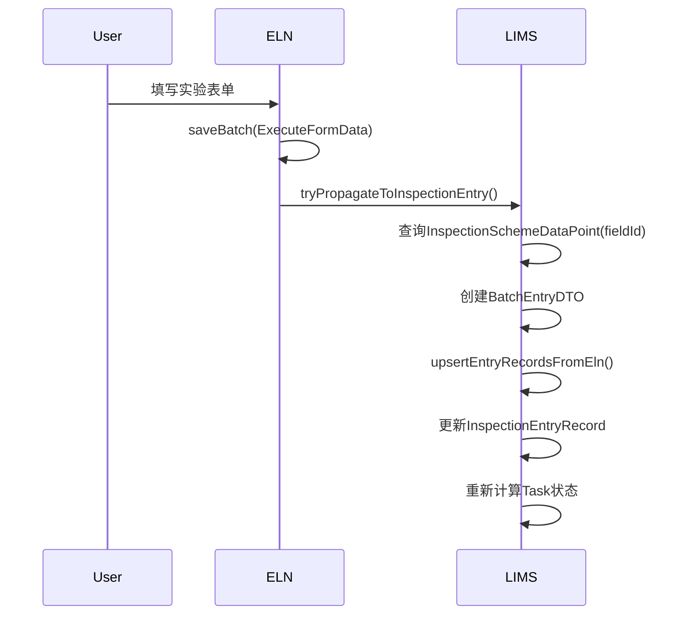
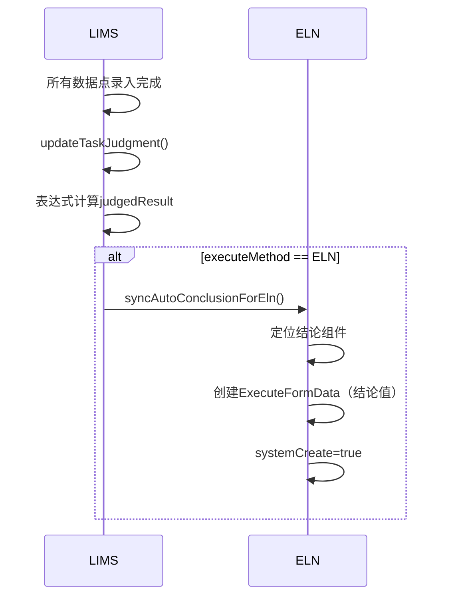
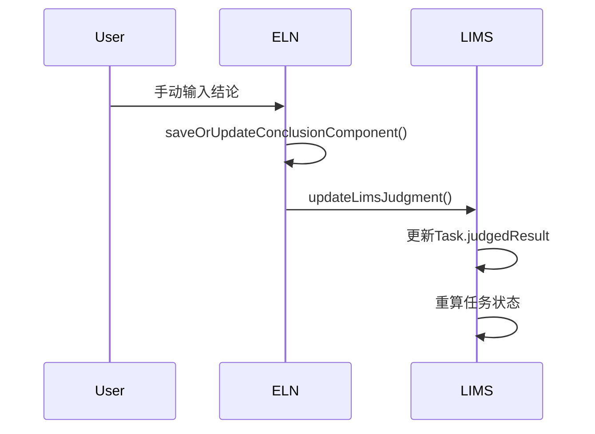

# ELN与LIMS数据交互关系总结

## 一、系统定位与职责

### LIMS (检验管理系统)
- **主控系统**：管理检验方案、任务流程、样品、报告
- **数据源**：检验方案配置、分析项定义、数据点配置
- **判定逻辑**：计算检验结论、判定是否合格
- **核心模块**：`inspect.*`（检验）、`sample.*`（样品）、`material.*`（物料）

### ELN (电子实验记录本)
- **执行平台**：提供灵活的实验过程记录和表单填写
- **数据存储**：存储实验方法模板和执行过程数据
- **可选执行**：当任务配置为ELN执行时启用
- **核心模块**：`eln.*`（entry/record/conclusion）

---

## 二、核心数据模型

### 1. LIMS核心实体

| 实体 | 表名 | 作用 |
|------|------|------|
| Task | bm_task | **关键枢纽**，记录任务ID、检验单ID、分析项ID、执行方式 |
| InspectionOrder | - | 检验单（订单） |
| InspectionScheme | - | 检验方案模板 |
| InspectionSchemeParameter | - | 方案中的分析项配置，**关联ELN方法** |
| InspectionSchemeDataPoint | - | **数据点配置，绑定ELN字段** |
| InspectionEntryRecord | - | LIMS数据录入记录 |
| InspectParameter | - | 分析项基础定义 |

### 2. ELN核心实体

| 实体 | 表名 | 作用 |
|------|------|------|
| BatchRecord | - | 实验方法（程序）定义 |
| BatchRecordVersion | - | 方法版本 |
| BatchRecordItem | - | 方法步骤/项目 |
| BatchRecordComponent | - | 组件（包括结论组件） |
| ExecuteFormData | bm_execute_form_data | **ELN执行数据，关联LIMS任务** |
| ExecuteAttachment | - | 附件/媒体文件 |

### 3. 关键关联字段

**Task表中的ELN关联字段：**
```java
executeMethod        // 执行方式：LIMS | ELN
recordId             // ELN方法ID
recordVersionId      // ELN方法版本ID
recordItemId         // ELN方法项目ID
```

**InspectionSchemeDataPoint中的ELN绑定：**
```java
fieldId              // ELN表单字段ID（绑定关键）
recordId             // ELN方法ID
recordVersionId      // ELN方法版本ID
componentId          // ELN组件ID
```

**ExecuteFormData中的LIMS关联：**
```java
inspectionOrderId    // 检验单ID
taskId               // 任务ID
fieldId              // 字段ID（与DataPoint绑定）
value                // 执行数据值
```

---

## 三、数据流动方向

### 主数据流：ELN → LIMS（结果回传）

```
ELN表单填写 → ExecuteFormData → 通过fieldId绑定 → InspectionSchemeDataPoint → InspectionEntryRecord (LIMS数据)
```

**核心方法：**
- `ExecuteFormDataServiceImpl.tryPropagateToInspectionEntry()` - 新增时传播
- `ExecuteFormDataServiceImpl.tryPropagateModifyToInspectionEntry()` - 修改时传播

**触发时机：**
- ELN执行数据保存时（saveBatch）
- ELN执行数据修改时（modify）

### 反向数据流：LIMS → ELN（结论同步）

```
LIMS计算判定 → Task.judgedResult → 同步到ELN结论组件 → ExecuteFormData (结论字段)
```

**核心方法：**
- `ConclusionService.syncAutoConclusionForEln()` - 自动结论同步
- `InspectionEntryServiceImpl.updateTaskJudgment()` - 触发点

**触发条件：**
- 任务执行方式为ELN（task.executeMethod == ELN）
- LIMS自动计算判定结果后
- 标记为systemCreate=true（系统生成）

### 手动同步：ELN → LIMS（显式API）

```
外部调用 → POST /api/inspection-entry/eln-sync → upsertEntryRecordsFromEln() → 批量更新LIMS数据
```

**特点：**
- 自动检测是insert还是update
- 跳过任务状态重算（skipStatusRecalc=true）
- 仍触发判定结论计算

---

## 四、关键集成场景

### 场景1：ELN执行带LIMS数据同步



**步骤：**
1. 任务创建，executeMethod = "ELN"
2. 用户在ELN填写表单
3. ExecuteFormData保存时自动触发
4. 通过fieldId查询对应的InspectionSchemeDataPoint
5. 将ELN值写入LIMS的InspectionEntryRecord
6. 任务状态自动更新

### 场景2：LIMS自动判定同步到ELN



**步骤：**
1. LIMS所有必填数据点已录入
2. 任务状态变为"待审核"
3. 触发updateTaskJudgment()自动计算
4. 如果task.executeMethod == "ELN"，同步结论
5. 在ELN的结论组件中写入判定结果

### 场景3：ELN手动结论反写LIMS



**步骤：**
1. 用户在ELN手动填写结论组件
2. 触发ConclusionService保存
3. 自动调用updateLimsJudgment()
4. 更新LIMS任务的judgedResult字段
5. 任务状态重新计算

### 场景4：外部ELN系统显式同步

```
POST /api/app/lims2/inspection-entry/eln-sync
Body: BatchEntryDTO
```

**特点：**
- 适用于外部ELN系统集成
- 根据(taskId, dataPointConfigId)判断insert/update
- skipStatusRecalc=true（外部系统自己控制状态）
- 仍会触发判定计算

---

## 五、执行方式控制

### ExecuteMethodEnum枚举

| 值 | 说明 | 数据录入方式 |
|----|------|-------------|
| LIMS | LIMS执行 | LIMS数据录入界面 |
| ELN | ELN执行 | ELN实验表单，自动同步到LIMS |

### 配置层级

1. **方案级别**：InspectionSchemeParameter.executeMethod
   - 配置某个分析项使用ELN还是LIMS执行
   - 关联ELN方法：recordId, recordVersionId, recordItemId

2. **任务级别**：Task.executeMethod
   - 从InspectionSchemeParameter复制而来
   - 运行时决定数据流向

---

## 六、数据绑定机制

### 关键绑定：fieldId

**InspectionSchemeDataPoint表：**
```java
parameterId          // 分析项ID（LIMS）
dataPointConfigId    // 数据点配置ID（LIMS）
fieldId              // ELN字段ID（绑定键）
recordId             // ELN方法ID
recordVersionId      // ELN方法版本ID
```

**ExecuteFormData表：**
```java
fieldId              // ELN字段ID（绑定键）
value                // 实际值
taskId               // 任务ID
inspectionOrderId    // 检验单ID
```

**绑定查询SQL：**
```sql
SELECT * FROM inspection_scheme_data_point
WHERE parameter_id = ?
  AND field_id = ?
```

**数据流转：**
```
ExecuteFormData.value (fieldId=100)
  → 匹配 →
InspectionSchemeDataPoint (fieldId=100, dataPointConfigId=50)
  → 创建 →
InspectionEntryRecord (dataPointConfigId=50, value=xxx)
```

---

## 七、事务与一致性

### 事务控制

- 所有同步操作使用 `@Transactional(rollbackFor = Exception.class)`
- ELN执行数据使用Redis锁：`EXECUTE_EXPRESS`
- 同步失败记录警告日志但不阻断主流程

### 状态计算

**Task状态自动计算依据：**
- 数据完整性（必填数据点是否填完）
- 检验时间
- 判定结果

**判定结果自动计算：**
- 所有必填数据点有值时触发
- 根据配置的表达式计算
- ELN结论同步不触发状态重算（skipStatusRecalc标志）

### 审计追踪

| 字段 | 作用 |
|------|------|
| TaskStatusHistory | 记录任务状态变更 |
| InspectionEntryHistory | 记录数据点值变更 |
| ExecuteFormData.systemCreate | 标记系统自动生成（true=LIMS同步的结论） |

---

## 八、核心API接口

### LIMS侧接口（InspectionEntryService）

| 方法 | 用途 | 事务 |
|------|------|------|
| batchSaveEntryRecords() | 标准LIMS数据录入 | ✓ |
| upsertEntryRecordsFromEln() | ELN同步，自动insert/update | ✓ |
| updateTaskJudgment() | 自动计算判定并同步ELN | ✓ |
| syncAutoConclusionForEln() | 触发结论同步到ELN | ✓ |
| batchUpdateJudgment() | 批量更新判定 | ✓ |

### ELN侧接口（ExecuteFormDataService）

| 方法 | 用途 | 事务 |
|------|------|------|
| saveBatch() | 保存执行数据，同步LIMS | ✓ |
| modify() | 修改字段值，同步LIMS | ✓ |
| tryPropagateToInspectionEntry() | 新增时传播到LIMS | ✓ |
| tryPropagateModifyToInspectionEntry() | 修改时传播到LIMS | ✓ |
| syncLimsConclusion() | 推送结论到LIMS | ✓ |

### ELN结论接口（ConclusionService）

| 方法 | 用途 | 事务 |
|------|------|------|
| saveOrUpdateConclusionComponent() | 保存结论并同步LIMS | ✓ |
| syncAutoConclusionForEln() | LIMS结论同步到ELN | ✓ |
| updateLimsJudgment() | 更新LIMS判定 | ✓ |

---

## 九、数据库关系图

```
Task (枢纽表)
├─ inspectionOrderId ────────→ InspectionOrder
├─ schemeVersionId ──────────→ InspectionSchemeVersion
├─ parameterId ──────────────→ InspectParameter
├─ parameterConfigId ────────→ InspectionSchemeParameter
│                                  ├─ recordId ──────→ BatchRecord (ELN)
│                                  ├─ recordVersionId → BatchRecordVersion
│                                  └─ recordItemId ───→ BatchRecordItem
├─ recordVersionId ──────────→ BatchRecordVersion (ELN执行)
├─ recordItemId ─────────────→ BatchRecordItem
└─ executeMethod (LIMS | ELN)

InspectionSchemeDataPoint (数据点配置)
├─ parameterId ──────────────→ InspectParameter
├─ parameterConfigId ────────→ InspectionSchemeParameter
├─ fieldId (关键绑定) ───────→ ExecuteFormData.fieldId
├─ recordId ─────────────────→ BatchRecord
├─ recordVersionId ──────────→ BatchRecordVersion
└─ componentId ──────────────→ BatchRecordComponent

ExecuteFormData (ELN执行数据)
├─ inspectionOrderId ────────→ InspectionOrder
├─ taskId ───────────────────→ Task
├─ fieldId (关键绑定) ───────→ InspectionSchemeDataPoint.fieldId
├─ recordVersionId ──────────→ BatchRecordVersion
└─ value (执行结果)

InspectionEntryRecord (LIMS录入数据)
├─ taskId ───────────────────→ Task
├─ inspectionOrderId ────────→ InspectionOrder
├─ dataPointConfigId ────────→ InspectionSchemeDataPoint
└─ value (LIMS数据)
```

---

## 十、集成架构总结

### 架构模式
**紧耦合混合模式（Tightly-Integrated Hybrid Model）**

- LIMS作为主控系统（Master Controller）
- ELN作为可选执行平台（Optional Execution Platform）
- 通过fieldId实现双向字段级绑定
- 自动化数据同步机制

### 数据主权
| 数据类型 | 主控系统 | 说明 |
|---------|---------|------|
| 检验方案 | LIMS | 方案、分析项、数据点配置 |
| 任务流程 | LIMS | 任务生命周期、状态管理 |
| 执行过程 | ELN | 实验步骤、表单填写 |
| 判定结论 | LIMS | 自动计算，可同步到ELN |
| 最终报告 | LIMS | 统一报告和判定 |

### 适用场景

**使用ELN执行（executeMethod=ELN）：**
- 需要复杂的实验过程记录
- 需要附件、图片、签名等丰富内容
- 需要按步骤引导实验操作
- 数据自动回传LIMS进行统一管理

**使用LIMS执行（executeMethod=LIMS）：**
- 简单数值录入
- 不需要过程记录
- 标准检验流程

### 优势
1. **灵活性**：根据分析项特点选择执行方式
2. **自动化**：数据自动双向同步，无需手动对接
3. **统一管理**：LIMS统一管理所有检验数据和报告
4. **过程可追溯**：ELN保留完整实验过程记录

### 注意事项
1. fieldId绑定关系必须在方案配置时正确设置
2. 数据同步失败不会阻断主流程，但会记录日志
3. 外部ELN系统调用需使用显式同步API
4. systemCreate标志用于区分系统自动生成和用户录入
