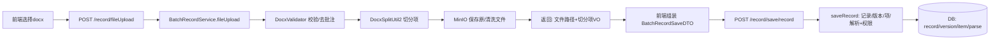
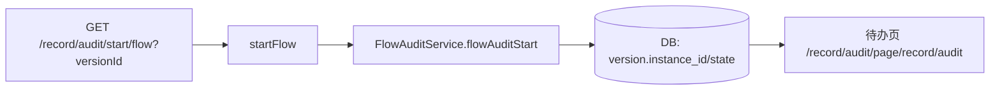

## 记录模块说明文档

### 1. 模块概览
- 模块分层与包：
  - Controller：`com.bmos.lims2.web.eln.record.controller`
  - Service：`com.bmos.lims2.server.eln.record.service` 及 `impl`
  - Mapper/XML：`com.bmos.lims2.server.eln.record.mapper`、`resources/mapper/...`
  - DTO/VO/Entity：位于 `com.bmos.lims2.server.eln.record` 子包
- 领域对象：记录、记录版本、记录项、记录项解析、记录组件（含树结构/业务组件）、分类、产品绑定、公式绑定
- 外部依赖：
  - MinIO（记录文件持久化）
  - 平台部门权限（数据权限过滤）
  - 平台公式服务（表达式树、绑定）
  - 审核引擎（发起审核、回调状态流转）

---

### 2. 数据库设计（ER 图）
```mermaid
erDiagram
  bm_batch_record ||--o{ bm_batch_record_version : has
  bm_batch_record ||--o{ bm_batch_record_product : binds
  bm_batch_record ||--o{ bm_batch_record_expression : binds
  bm_batch_record_category ||--o{ bm_batch_record : categorizes
  bm_batch_record_version ||--o{ bm_batch_record_item : has
  bm_batch_record_item ||--|| bm_batch_record_parse : parses
  bm_batch_record_item ||--o{ bm_batch_record_component : has
  bm_batch_record_component ||--o{ bm_batch_record_component : parent_child

  bm_batch_record {
    bigint id PK // 主键id
    varchar name // 记录名称
    bigint category_id FK // 分类id -> bm_batch_record_category.id
    datetime create_time // 创建时间
    datetime update_time // 修改时间
    varchar create_by // 创建人
    varchar update_by // 修改人
    tinyint is_deleted // 是否删除
    UNIQUE name,is_deleted // 唯一索引(name,is_deleted)
  }

  bm_batch_record_category {
    bigint id PK // 主键id
    varchar name // 分类名称
    varchar code // 分类编码
    bigint parent_id // 上级id（0为根）
    bigint sort // 排序号
    datetime create_time // 创建时间
    datetime update_time // 修改时间
    varchar create_by // 创建人
    varchar update_by // 修改人
    tinyint is_deleted // 是否删除
    bigint del_flag // 预留删除标记
  }

  bm_batch_record_version {
    bigint id PK // 主键id
    bigint record_id FK // 记录管理表id -> bm_batch_record.id
    varchar version // 版本号
    varchar state // 状态：1可编辑；2审核；3确定；4作废
    varchar instance_id // 流程实例id
    varchar file_path // 存放文件地址
    varchar remark // 备注
    datetime create_time // 创建时间
    datetime update_time // 修改时间
    varchar create_by // 创建人
    varchar update_by // 修改人
    tinyint is_deleted // 是否删除
    UNIQUE record_id,version // 唯一索引(record_id,version)
  }

  bm_batch_record_item {
    bigint id PK // 主键id
    varchar name // 记录项名称
    bigint item_id // 业务id（用于组件关联）
    varchar item_path // 单项指令集地址
    varchar item_type // 0:内容;1:页眉/页脚
    int sort // 排序字段
    mediumblob file_content // 记录项内容
    varchar file_path // 文件路径
    int max_number // 文档最大下标
    varchar version // 版本号
    varchar page_config // 文档配置(JSON)
    bigint record_version_id FK // 记录版本表id -> bm_batch_record_version.id
    longtext docx_header // 页眉
    longtext docx_footer // 页脚
    tinyint first_different // 首页不同
    int page_number_style // 页码样式
    int page_starting_number // 页码起始值
    tinyint odd_and_even_different // 奇偶不同
    datetime create_time // 创建时间
    datetime update_time // 修改时间
    varchar create_by // 创建人
    varchar update_by // 修改人
    tinyint is_deleted // 是否删除
    INDEX item_id,record_version_id // 索引
  }

  bm_batch_record_parse {
    bigint id PK, FK // 记录项id -> bm_batch_record_item.id
    mediumblob file_content // html字符串
    longtext docx_header // 页眉
    longtext docx_footer // 页脚
    datetime create_time // 创建时间
    datetime update_time // 修改时间
    varchar create_by // 创建人
    varchar update_by // 修改人
    tinyint is_deleted // 是否删除
  }

  bm_batch_record_component {
    bigint id PK // 主键id
    bigint record_item_id FK // 记录项业务id -> bm_batch_record_item.item_id
    bigint record_version_id FK // 版本id -> bm_batch_record_version.id
    varchar record_version // 批记录版本号
    bigint record_id FK // 批记录id -> bm_batch_record.id
    varchar component_type // 组件类型
    varchar component_name // 组件名称
    bigint field_id // 空格标识
    bigint component_number // 组件关联表格最大下标值
    bigint formula_precision // 精度
    longtext component_detail // 公式详细内容
    tinyint is_result // 是否计算结果(0/1)
    bigint formula_id // 公式id
    longtext formula_field // 公式实际参数字段JSON
    varchar formula_expression // 公式表达式
    varchar formula_type // 公式类型
    varchar round_code // 修约公式code
    bigint parent_id // 父级id -> bm_batch_record_component.id
    datetime create_time // 创建时间
    datetime update_time // 修改时间
    varchar create_by // 创建人
    varchar update_by // 修改人
    tinyint is_deleted // 是否删除
    tinyint used // 是否使用
    varchar date_type // 日期类型
    longtext formula_config // 公式额外配置
    INDEX record_item_id,record_version_id,field_id // 组合索引
  }

  bm_batch_record_component_detail {
    bigint id PK // 主键id
    longtext component_detail // 组件详细内容
    longtext formula_field // 公式实际参数字段JSON
    longtext formula_config // 公式额外配置
    datetime create_time // 创建时间
    datetime update_time // 修改时间
    varchar create_by // 创建人
    varchar update_by // 修改人
    tinyint is_deleted // 是否删除
  }

  bm_batch_record_product {
    bigint id PK // 主键id
    bigint record_id FK // 批记录id -> bm_batch_record.id
    bigint product_id // 产品id
    datetime create_time // 创建时间
    datetime update_time // 修改时间
    varchar create_by // 创建人
    varchar update_by // 修改人
    tinyint is_deleted // 是否删除
  }

  bm_batch_record_expression {
    bigint record_id FK // 记录id -> bm_batch_record.id
    bigint expression_id // 公式id(外部平台)
  }
```

> 建表脚本来源：`bmos-lims2-web/src/main/resources/init/db/V1.1.0_0.0.1__create_record_table.sql`

#### 2.1 字段明细

bm_batch_record（批记录信息）

| 字段 | 类型 | 主键/索引 | 可空 | 默认 | 备注 |
|---|---|---|---|---|---|
| id | bigint | PK | 否 |  | 主键id |
| name | varchar(64) | UK(name,is_deleted) | 否 |  | 记录名称 |
| category_id | bigint |  | 否 |  | 分类id（FK→bm_batch_record_category.id） |
| create_time | datetime |  | 是 |  | 创建时间 |
| update_time | datetime |  | 是 |  | 修改时间 |
| create_by | varchar(64) |  | 是 |  | 创建人 |
| update_by | varchar(64) |  | 是 |  | 修改人 |
| is_deleted | tinyint | UK(name,is_deleted) | 否 | 0 | 是否删除 |

bm_batch_record_category（记录配置分类表）

| 字段 | 类型 | 主键/索引 | 可空 | 默认 | 备注 |
|---|---|---|---|---|---|
| id | bigint | PK | 否 |  | 主键id |
| name | varchar(60) |  | 否 |  | 分类名称 |
| code | varchar(255) |  | 是 |  | 分类编码 |
| parent_id | bigint |  | 是 | 0 | 上级id（0为根） |
| sort | bigint |  | 是 |  | 排序号 |
| create_time | datetime |  | 是 |  | 创建时间 |
| update_time | datetime |  | 是 |  | 修改时间 |
| create_by | varchar(60) |  | 是 |  | 创建人 |
| update_by | varchar(60) |  | 是 |  | 修改人 |
| is_deleted | tinyint |  | 是 | 0 | 是否删除 |
| del_flag | bigint |  | 否 | 0 | 预留删除标记 |

bm_batch_record_version（记录版本表）

| 字段 | 类型 | 主键/索引 | 可空 | 默认 | 备注 |
|---|---|---|---|---|---|
| id | bigint | PK | 否 |  | 主键id |
| record_id | bigint | UK(record_id,version) | 否 |  | 记录管理表id（FK→bm_batch_record.id） |
| version | varchar(32) | UK(record_id,version) | 否 |  | 版本号 |
| state | varchar(32) |  | 否 | '1' | 状态：1可编辑；2审核；3确定；4作废 |
| instance_id | varchar(64) |  | 是 |  | 流程实例id |
| file_path | varchar(255) |  | 是 |  | 存放文件地址 |
| remark | varchar(255) |  | 是 |  | 备注 |
| create_time | datetime |  | 是 |  | 创建时间 |
| update_time | datetime |  | 是 |  | 修改时间 |
| create_by | varchar(64) |  | 是 |  | 创建人 |
| update_by | varchar(64) |  | 是 |  | 修改人 |
| is_deleted | tinyint |  | 是 | 0 | 是否删除 |

bm_batch_record_item（记录项表）

| 字段 | 类型 | 主键/索引 | 可空 | 默认 | 备注 |
|---|---|---|---|---|---|
| id | bigint | PK | 否 |  | 主键id |
| name | varchar(100) |  | 是 |  | 记录项名称 |
| item_id | bigint | IDX(item_id,record_version_id) | 否 |  | 业务id（组件关联用） |
| item_path | varchar(255) |  | 是 |  | 上传单个记录项指令集地址 |
| item_type | varchar(255) |  | 是 |  | 0:大纲内容false，1：页眉页脚内容true |
| sort | int |  | 是 |  | 排序字段 |
| file_content | mediumblob |  | 是 |  | 记录项内容 |
| file_path | varchar(1024) |  | 是 |  | 文件路径 |
| max_number | int |  | 是 |  | 文档最大下标 |
| version | varchar(64) |  | 是 |  | 版本号 |
| page_config | varchar(255) |  | 是 | {"pattern":1} | 文档配置 |
| record_version_id | bigint | IDX(item_id,record_version_id) | 是 |  | 记录版本表id（FK→bm_batch_record_version.id） |
| docx_header | longtext |  | 是 |  | 页眉 |
| docx_footer | longtext |  | 是 |  | 页脚 |
| first_different | tinyint(1) |  | 是 |  | 首页不同 |
| page_number_style | int |  | 是 |  | 页码样式 |
| page_starting_number | int |  | 是 |  | 页码起始值 |
| odd_and_even_different | tinyint(1) |  | 是 |  | 奇偶不同 |
| create_time | datetime |  | 是 |  | 创建时间 |
| update_time | datetime |  | 是 |  | 修改时间 |
| create_by | varchar(60) |  | 是 |  | 创建人 |
| update_by | varchar(60) |  | 是 |  | 修改人 |
| is_deleted | tinyint |  | 是 | 0 | 是否删除 |

bm_batch_record_parse（记录解析html表）

| 字段 | 类型 | 主键/索引 | 可空 | 默认 | 备注 |
|---|---|---|---|---|---|
| id | bigint | PK(FK) | 否 |  | 记录项id（FK→bm_batch_record_item.id） |
| file_content | mediumblob |  | 是 |  | html字符串 |
| docx_header | longtext |  | 是 |  | 页眉 |
| docx_footer | longtext |  | 是 |  | 页脚 |
| create_time | datetime |  | 是 |  | 创建时间 |
| update_time | datetime |  | 是 |  | 修改时间 |
| create_by | varchar(60) |  | 是 |  | 创建人 |
| update_by | varchar(60) |  | 是 |  | 修改人 |
| is_deleted | tinyint |  | 是 | 0 | 是否删除 |

bm_batch_record_component（记录组件表）

| 字段 | 类型 | 主键/索引 | 可空 | 默认 | 备注 |
|---|---|---|---|---|---|
| id | bigint | PK | 否 |  | 主键id |
| record_item_id | bigint | IDX(record_item_id,record_version_id,field_id) | 否 |  | 记录项业务id（FK→bm_batch_record_item.item_id） |
| record_version_id | bigint | IDX(record_item_id,record_version_id,field_id) | 是 |  | 版本id（FK→bm_batch_record_version.id） |
| record_version | varchar(64) |  | 是 |  | 批记录版本号 |
| record_id | bigint |  | 是 |  | 记录id（FK→bm_batch_record.id） |
| component_type | varchar(64) |  | 是 |  | 组件类型 |
| component_name | varchar(64) |  | 是 |  | 组件名称 |
| field_id | bigint | IDX(record_item_id,record_version_id,field_id) | 是 |  | 空格标识 |
| component_number | bigint |  | 是 |  | 组件关联表格最大下标值 |
| formula_precision | bigint |  | 是 |  | 精度 |
| component_detail | longtext |  | 是 |  | 公式详细内容 |
| is_result | tinyint |  | 是 |  | 是否计算结果(0/1) |
| formula_id | bigint |  | 是 |  | 公式id |
| formula_field | longtext |  | 是 |  | 公式实际参数字段JSON |
| formula_expression | varchar(60) |  | 是 |  | 公式表达式 |
| formula_type | varchar(60) |  | 是 |  | 公式类型 |
| round_code | varchar(60) |  | 是 |  | 修约公式code |
| parent_id | bigint |  | 是 | 0 | 父级id（自关联） |
| create_time | datetime |  | 是 |  | 创建时间 |
| update_time | datetime |  | 是 |  | 修改时间 |
| create_by | varchar(64) |  | 是 |  | 创建人 |
| update_by | varchar(64) |  | 是 |  | 修改人 |
| is_deleted | tinyint |  | 是 | 0 | 是否删除 |
| used | tinyint(1) |  | 是 |  | 是否使用 |
| date_type | varchar(60) |  | 是 |  | 日期类型 |
| formula_config | longtext |  | 是 |  | 公式额外配置 |

bm_batch_record_component_detail（记录组件明细表）

| 字段 | 类型 | 主键/索引 | 可空 | 默认 | 备注 |
|---|---|---|---|---|---|
| id | bigint | PK | 否 |  | 主键id |
| component_detail | longtext |  | 是 |  | 组件详细内容 |
| formula_field | longtext |  | 是 |  | 公式实际参数字段JSON |
| formula_config | longtext |  | 是 |  | 公式额外配置 |
| create_time | datetime |  | 是 |  | 创建时间 |
| update_time | datetime |  | 是 |  | 修改时间 |
| create_by | varchar(64) |  | 是 |  | 创建人 |
| update_by | varchar(64) |  | 是 |  | 修改人 |
| is_deleted | tinyint |  | 是 | 0 | 是否删除 |

bm_batch_record_product（记录关联产品表）

| 字段 | 类型 | 主键/索引 | 可空 | 默认 | 备注 |
|---|---|---|---|---|---|
| id | bigint | PK | 否 |  | 主键id |
| record_id | bigint |  | 否 |  | 批记录id（FK→bm_batch_record.id） |
| product_id | bigint |  | 否 |  | 产品id |
| create_time | datetime |  | 是 |  | 创建时间 |
| update_time | datetime |  | 是 |  | 修改时间 |
| create_by | varchar(60) |  | 是 |  | 创建人 |
| update_by | varchar(60) |  | 是 |  | 修改人 |
| is_deleted | tinyint |  | 是 | 0 | 是否删除 |

bm_batch_record_expression（记录与公式绑定关系）

| 字段 | 类型 | 主键/索引 | 可空 | 默认 | 备注 |
|---|---|---|---|---|---|
| record_id | bigint |  | 否 |  | 记录id（FK→bm_batch_record.id） |
| expression_id | bigint |  | 否 |  | 公式id（平台侧） |

#### 2.2 外键与关联关系（字段级）

- bm_batch_record.category_id → bm_batch_record_category.id
- bm_batch_record_version.record_id → bm_batch_record.id
- bm_batch_record_item.record_version_id → bm_batch_record_version.id
- bm_batch_record_parse.id → bm_batch_record_item.id（同主键）
- bm_batch_record_component.record_item_id → bm_batch_record_item.item_id（业务id）
- bm_batch_record_component.record_version_id → bm_batch_record_version.id
- bm_batch_record_component.parent_id → bm_batch_record_component.id（自关联）
- bm_batch_record_component.record_id → bm_batch_record.id
- bm_batch_record_product.record_id → bm_batch_record.id
- bm_batch_record_expression.record_id → bm_batch_record.id
- bm_batch_record_expression.expression_id → 平台公式（外部）

---

### 3. 接口清单与实现要点

#### 3.1 批记录配置接口（`/record`，`BatchRecordController`）
- 分类
  - POST `/save/category`：新增分类 → `BatchRecordCategoryService.saveCategory`
  - POST `/update/category`：编辑分类 → `BatchRecordCategoryService.updateCategory`
  - GET `/delete/category?id`：删除分类 → `BatchRecordCategoryService.deleteCategory`
  - GET `/list/category`：查询分类列表 → `BatchRecordCategoryService.listCategory`
  - GET `/list/record/tree`：产品-记录树 → `BatchRecordCategoryService.listRecordTree`

- 记录与版本
  - POST `/save/record`：新增记录与版本并落项 → `BatchRecordService.saveRecord`
  - GET `/list/record`：记录分页（含部门权限）→ `BatchRecordService.getRecordPage`
  - POST `/copy/version`：复制版本（异步）→ `BatchRecordVersionService.copyVersion`
  - POST `/update/version`：更新版本 → `BatchRecordService.updateVersion`
  - GET `/list/version?recordId`：版本列表 → `BatchRecordVersionService.listVersion`
  - GET `/query/record/version?recordId`：版本下拉（过滤作废）→ `BatchRecordVersionService.queryRecordVersionByRecordId`
  - GET `/checkout/save/record?recordId`：校验是否可新增版本 → `BatchRecordVersionService.checkoutSaveRecord`

- 文件与记录项（Item）
  - POST `/fileUpload`：整包记录 docx 上传与切分 → `BatchRecordService.fileUpload`
  - POST `/record/item/upload`：单记录项上传 → `BatchRecordService.recordItemUpload`
  - GET `/copy/record/item?itemId&itemName`：（废弃）复制项 → `BatchRecordService.copyRecordItem`
  - GET `/delete/record/item?itemId`：删除项（含解析/组件）→ `BatchRecordService.deleteRecordItem`
  - GET `/production/id`：生成雪花ID列表 → `BatchRecordItemService.productionId`
  - POST `/list/record/item`：按版本ID集合查项 → `BatchRecordItemService.listRecordItem`
  - GET `/query/record/item?recordItemId&recordVersionId`：查单项 → `BatchRecordItemService.queryRecordItemByItemIdAndVersionId`
  - POST `/item/singleSave`：新增单项（含解析）→ `BatchRecordService.saveSingleItem`
  - POST `/item/singleEdit`：编辑单项并保存组件 → `BatchRecordService.editSingleItem`
  - GET `/item/detail?recordVersionId`：记录名称+项列表 → `BatchRecordVersionService.getRecordInfoAndItemList`
  - POST `/item/changeSort`：调整项顺序 → `BatchRecordVersionService.changeRecordItemSort`
  - PUT `/item/edit?recordVersionId`：记录编辑历史（预留，当前空实现）

- 组件与公式
  - GET `/list/component?itemId&recordVersionId`：查组件树 → `BatchRecordComponentService.listComponent`
  - POST `/save/formula`：保存组件公式配置 → `BatchRecordComponentService.saveFormula`
  - GET `/delete/formula?componentId`：清除组件公式 → `BatchRecordComponentService.deleteFormula`
  - GET `/functionTree`：平台公式+内置公式树 → `BatchRecordVersionService.queryPlatformExpressionAndBuiltInFunction`
  - POST `/function/preview`：公式计算预览 → `BatchRecordVersionService.getFunctionCalculatePreview`

- 记录与公式绑定
  - GET `/expressionBindTree?id`：按记录获取公式树（含绑定态）→ `BatchRecordService.getExpressionTreeByRecordId`
  - GET `/boundExpressionIdList?id`：记录绑定的公式ID列表 → `BatchRecordService.getRecordBoundExpressionIdList`
  - POST `/bindExpression`：记录绑定公式（全量覆盖）→ `BatchRecordService.bindExpression`

- 产品绑定
  - POST `/save/product`：记录绑定产品 → `BatchRecordProductService.saveProduct`
  - GET `/query/product/id?recordId`：查记录绑定的产品ID → `BatchRecordProductService.queryProductIdByRecordId`
  - GET `/list/product/record?productId[&recordId]`：按产品查记录 → `BatchRecordVersionService.listPorductRecord`
  - GET `/query/list/record?productId`：产品-记录下拉 → `BatchRecordService.queryListRecordByProductId`

- 其他
  - GET `/list/rounding`：修约规则下拉 → 枚举
  - POST `/handle/item`：存量数据拆分处理 → `BatchRecordItemService.handelItem`
  - POST `/item/changeName`：记录项重命名 → `BatchRecordItemService.changeItemName`
  - POST `/downloadByUrl?url`：按URL下载记录文件 → `BatchRecordService.downloadByUrl`

实现要点（节选）：
- `saveRecord`：懒创建 `recordId`，写 `bm_batch_record` 与 `bm_batch_record_version`，落记录项与解析，并保存部门权限；
- `fileUpload/recordItemUpload`：`DocxValidator` 预处理（去批注、格式化）+ `DocxSplitUtil2` 切分；MinIO 保存原/清洗文件；
- `editSingleItem`：对组件树做增量同步（新增/更新/删除），保持 `parent_id` 与版本/项一致；
- `copyVersion`：异步复制项、解析、组件（业务组件铺平并重建父子关系）；
- `getRecordPage`：无 `recordId` 时按部门权限与分类过滤返回首个版本；
- 绑定（记录↔公式、记录↔产品）：均为“先删旧后插新”的幂等覆盖写入；
- 审核：`startFlow` 发起流程并将版本状态流转，回调成功/驳回分别置“确定/编辑”。

#### 3.2 记录管理接口（`/record/manage`，`BatchRecordManageController`）
- GET `/list/record`：记录分页（不走部门权限）→ `BatchRecordManageService.getRecordPageWithNoPermission`
- POST `/save/formula`：保存组件公式配置并刷新图 → `BatchRecordComponentService.saveFormula` + `refreshGraph`
- GET `/delete/formula?componentId`：清除组件公式 → `BatchRecordManageService.deleteFormula`

#### 3.3 审核接口（`/record/audit`，`BatchRecordAuditController`）
- GET `/page/record/audit`：记录审核待办分页 → `BatchRecordVersionService.pageRecordAudit`
- GET `/start/flow?versionId`：记录发起审核 → `BatchRecordVersionService.startFlow`

#### 3.4 Feign 接口（`/record/feign`，`BatchRecordFeignController`）
- POST `/expressionBindRecord`：公式绑定记录（全量覆盖）→ `BatchRecordService.expressionBindBatchRecord`
- GET `/expressionBindTree?expressionId`：按公式获取记录树 → `BatchRecordService.getRecordTreeByExpressionId`
- GET `/boundRecordIdList?expressionId`：按公式已绑定的记录ID列表 → `BatchRecordService.getBoundRecordIdList`

---

### 4. 关键数据流（Mermaid）

#### 4.1 文件上传/切分/落库


#### 4.2 版本复制


#### 4.3 审核发起


#### 4.4 公式绑定（记录侧）


---

### 5. 注意事项与建议
- 大字段与长文本已分表（`bm_batch_record_parse`、`component_detail`），避免影响主表查询；
- 组件树维护需确保 `parent_id` 与版本/项维度一致，避免“跨版本污染”；
- 列表按部门维度过滤（`deptIds`），为空直接返回空页；
- 审核回调与操作历史记录留有实现点，可结合统一操作日志完善；
- 绑定接口均采用全量覆盖策略，前端提交需包含完整集合以免丢绑。

---

### 6. 关联源码位置（便于检索）
- Controller：
  - `bmos-lims2-web/src/main/java/com/bmos/lims2/web/eln/record/controller/BatchRecordController.java`
  - `bmos-lims2-web/src/main/java/com/bmos/lims2/web/eln/record/controller/BatchRecordManageController.java`
  - `bmos-lims2-web/src/main/java/com/bmos/lims2/web/eln/record/controller/BatchRecordAuditController.java`
  - `bmos-lims2-web/src/main/java/com/bmos/lims2/web/eln/record/controller/BatchRecordFeignController.java`
- Service 实现：
  - `bmos-lims2-server/src/main/java/com/bmos/lims2/server/eln/record/service/impl/BatchRecordServiceImpl.java`
  - `bmos-lims2-server/src/main/java/com/bmos/lims2/server/eln/record/service/impl/BatchRecordVersionServiceImpl.java`
- Mapper：
  - `bmos-lims2-server/src/main/java/com/bmos/lims2/server/eln/record/mapper/BatchRecordMapper.java`
- 建表 SQL：
  - `bmos-lims2-web/src/main/resources/init/db/V1.1.0_0.0.1__create_record_table.sql`


